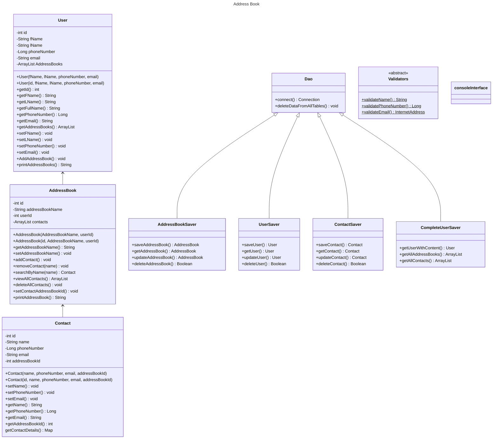
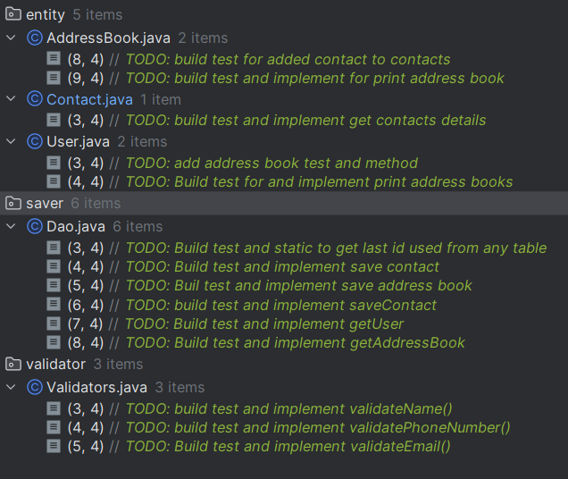
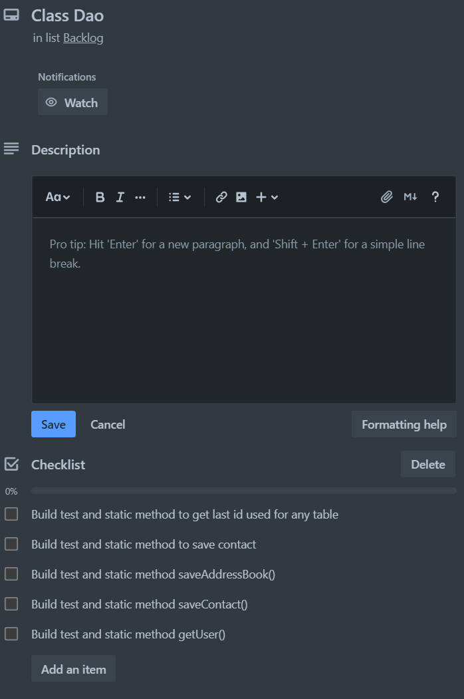
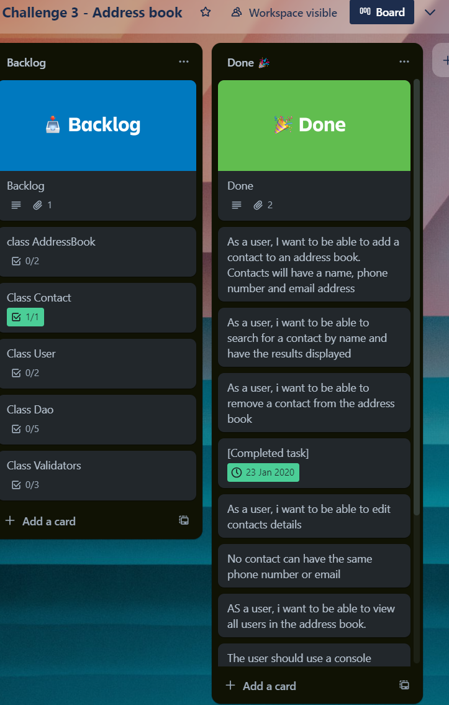
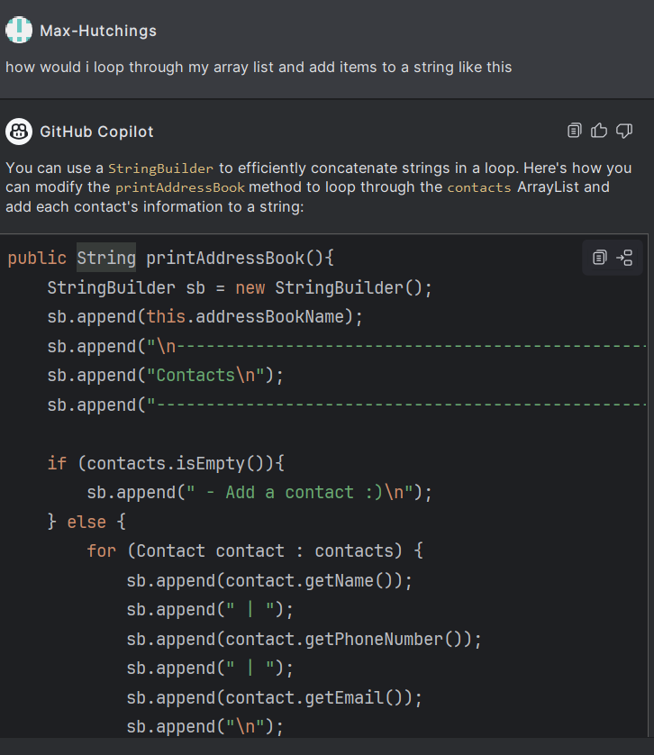
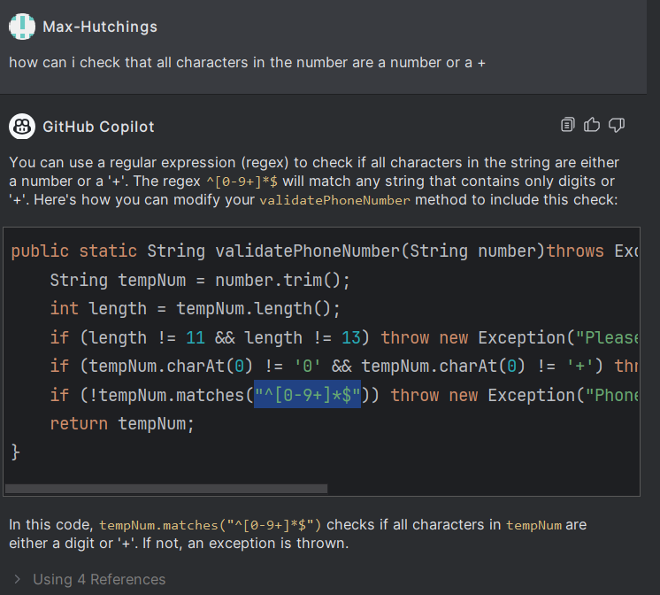
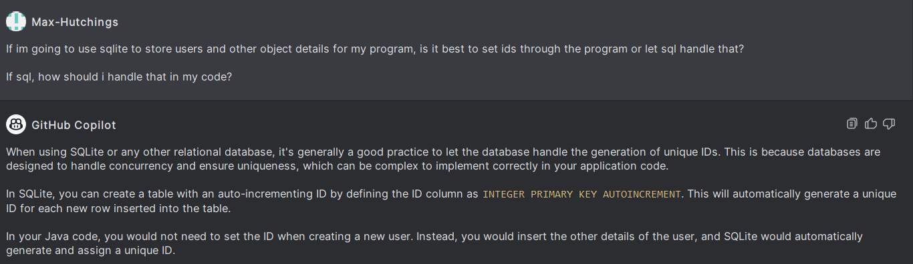

# Domain Models, Class Diagrams and Test Plan

```mermaid
---
title: Address Book
---
classDiagram
%%    User <-- AddressBook
%%    AddressBook <-- Contact

    direction TB
    User <-- AddressBook
    AddressBook <-- Contact
    Dao <|-- AddressBookSaver
    Dao <|-- UserSaver
    Dao <|-- ContactSaver
    Dao <|-- CompleteUserSaver
    
    class User{
        -int id
        -String fName
        -String lName
        -Long phoneNumber
        -String email
        -ArrayList<AddressBook> AddressBooks
        
        +User(fName, lName, phoneNumber, email)
        +User(id, fName, lName, phoneNumber, email)
        +getId() int
        +getFName() String
        +getLName() String
        +getFullName() String
        +getPhoneNumber() Long
        +getEmail() String
        +getAddressBooks() ArrayList<AddressBook>
        +setFName() void
        +setLName() void
        +setPhoneNumber() void
        +setEmail() void
        +AddAddressBook() void
        +printAddressBooks() String
    }
    
    class AddressBook{
        -int id
        -String addressBookName
        -int userId
        -ArrayList<Contact> contacts
        
        +AddressBook(AddressBookName, userId)
        +AddressBook(id, AddressBookName, userId)
        +getAddressBookName() String
        +setAddressBookName() void
        +addContact() void
        +removeContact(name) void
        +searchByName(name) Contact
        +viewAllContacts() ArrayList<Contacts>
        +deleteAllContacts() void
        +setContactAddressBookId() void
        +printAddressBook() String
        
 }
 
    class Contact{
        -int id
        -String name
        -Long phoneNumber
        -String email
        -int addressBookId
        
        +Contact(name, phoneNumber, email, addressBookId)
        +Contact(id, name, phoneNumber, email, addressBookId)
        +setName() void
        +setPhoneNumber() void
        +setEmail() void
        +getName() String
        +getPhoneNumber() Long
        +getEmail() String
        +getAddressBookId() int
        getContactDetails() Map<String, String>
        
    }
    
    class Validators{
        <<abstract>>
        +validateName()$ String
        +validatePhoneNumber()$ Long
        +validateEmail()$ InternetAddress
    }
    
    class Dao{
        
        +connect() Connection
        +deleteDataFromAllTables() void
    }
    
    class AddressBookSaver {
        +saveAddressBook() AddressBook
        +getAddressBook() AddressBook
        +updateAddressBook() AddressBook
        +deleteAddressBook() Boolean
    }
    
    class UserSaver {
        +saveUser() User
        +getUser() User
        +updateUser() User
        +deleteUser() Boolean
    }
    
    class ContactSaver {
        +saveContact() Contact
        +getContact() Contact
        +updateContact() Contact
        +deleteContact() Boolean
    }
    
    class CompleteUserSaver{
        +getUserWithContent() User
        +getAllAddressBooks() ArrayList<AddressBook>
        +getAllContacts() ArrayList<Contact>
    }
    
    class consoleInterface{
        
    }
    
    
    

```

 proof of ai

Resources
https://jenkov.com/tutorials/java-unit-testing/database-testing-crud.html