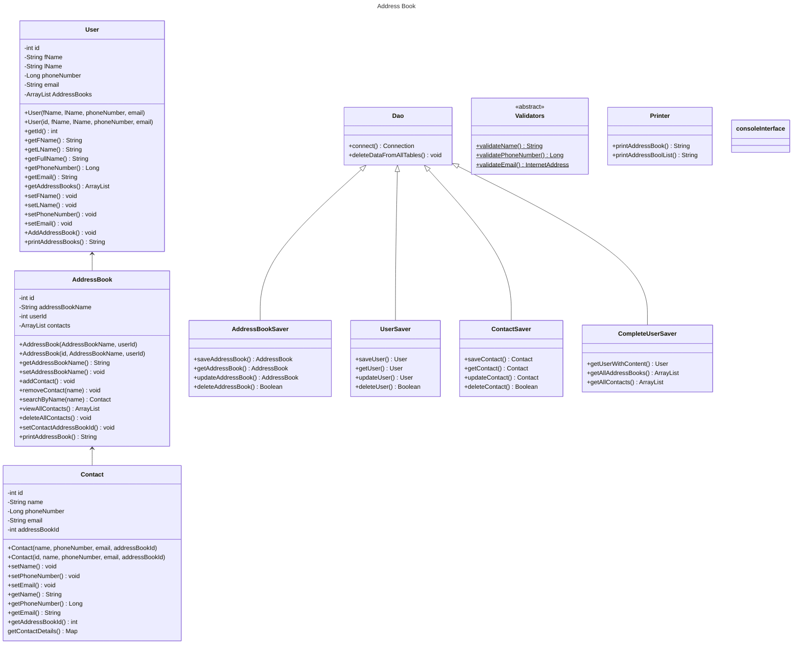
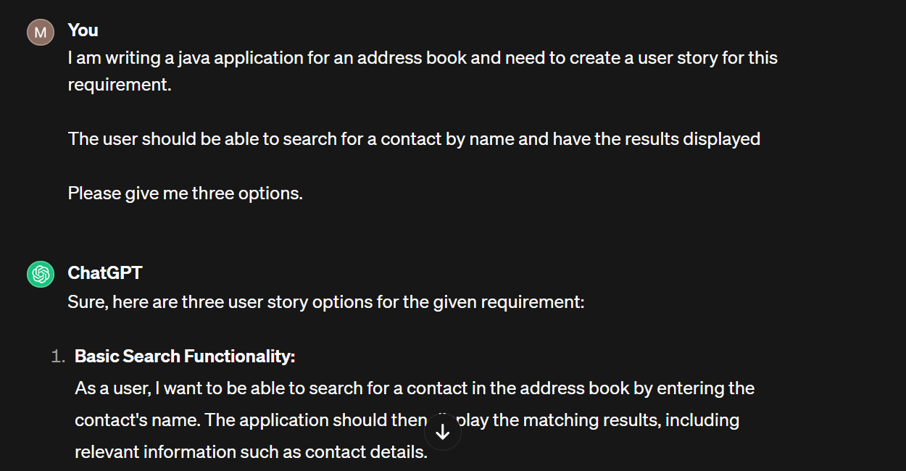

# Domain Models, Class Diagrams and Test Plan

# Address Book Challenge
## Introduction

Business efficiency is one of the top priorities for companies in 2023. Efficiency allows products and services to be produced at lower cost, allowing for greater financial success for the company and a lower customer cost for that organisation's clients. Our Digital Futures analysts have spent years researching how business efficiency can be improved, and have arrived at our digital address book software.

Our data showed too much employee time and money was spent using paper address books, organising paper address books, and storing paper address books. Our digital solution aims to provide a complete solution, where each individual in your organisation can have an account tailored to them, where they can store address books and assign contacts to those address books. The ability for each user to have multiple address books will help your employees organise their contacts into specific categories - a feature no other digital address book on the market offers.

We aim to take the complexity, time and cost out of contact detail maintenance. Welcome, to the DF Digital Address Book!

## The problem being solved
1.  Time: One of the primary drawbacks of using a paper address book is the time it takes to find and update information manually. Searching for a particular contact can be cumbersome, especially as the book size grows. Unlike our digital address book application, which offers search functionalities, paper address books require manual scanning or flipping through pages to find the desired contact. This process can become time-consuming, especially when dealing with a large number of contacts.
2.  Complexity:  Paper address books lack the organisation and categorisation features that the digital address book provides. Our digital address book application allows you to sort contacts into different address books that you can add a custom name to. This sorting capability simplifies the process of finding specific contacts or filtering contacts based on specific criteria. On the other hand, manually organizing and updating a paper address book can quickly become complicated and difficult to manage.
3.  Storage: As the number of contacts grows, paper address books can occupy significant physical space. Storing and managing multiple address books can be inconvenient, especially when trying to access contact information from different locations. In contrast, digital address book utilises minimal physical space since they are stored electronically. With digital address books, you can access and update contact information with nothing but a laptop.

## Benefits of our software
1.  Store all contact information for the people in your life in a single place.
2.  Have as many address books as you like, each with a name you can define, to help you organise your contact information.
3.  Search for contacts by name, phone number or email address to save you time.
4.  Easily edit contact information as their details change.
5.  No contact within the same address book will be able to have the same phone number or email, to prevent you from creating duplicates.
6. Easily view every contact in your address book with their details laid out beside them.
7.  Easy delete-all feature allows you to throw away all your contacts from an address book.
8.  Store all your information in a database, allowing you to access the data at any time – whether the application is stopped or not.

## The impact for your business

1. Improved Productivity: The digital address book software streamlines the process of managing and accessing contact information. This saves time for employees who no longer need to rely on manual searches through paper address books. With the ability to search contacts by name, phone number, or email address, employees can quickly find the information they need, allowing them to focus more on their core tasks and enhancing overall productivity.

2. Enhanced Organization: With the software's capability to create multiple address books with custom names, the business can effectively categorize and organize contact information. This feature proves especially helpful when dealing with various stakeholders, such as clients, suppliers, or partners. Employees can keep their contacts segregated appropriately, ensuring easy access and efficient communication with the right individuals or groups.

3. Minimized Data Duplication: The digital address book software prevents the creation of duplicate contacts within the same address book. This helps maintain data accuracy and integrity, as duplicates can lead to confusion, miscommunication, and wasted resources. Having a reliable and clean database of contact information ensures that employees are always working with accurate data, reducing errors and improving the overall efficiency of the business.

4. Centralized Contact Management: The software allows businesses to consolidate all contact information in a single, easily accessible location. This centralized approach eliminates the need for scattered paper address books or individual employee contact lists. Consequently, the entire organization benefits from synchronized and up-to-date contact information, reducing the chances of outdated or incorrect details being used for communication.

5. Easy Updates and Maintenance: The digital address book software simplifies the process of updating contact information. As details change, employees can easily edit the relevant contact entries, ensuring that accurate information is always available. Additionally, storing information in a database, as offered by the software, provides long-term data persistence even if the application is stopped or restarted, ensuring data integrity and easy access at any time. This further saves time and reduces costs as editing contacts in non-digital solutions causes a mess in the documentation.

6. Customer Satisfaction: By using your digital address book software, businesses can improve their communication processes with customers, clients, and other external contacts. With faster access to accurate contact information, employees can respond promptly and efficiently to inquiries, requests, and issues. This enhanced responsiveness and professionalism contribute to overall customer satisfaction and can positively impact the business's reputation.

### Initial Plan
## User Stories

## Class Diagrams

# Trello Planning
### All ToDos per section

### Adding class models to Trello with Tasks in each section

# Documenting the use of AI
### Creating User Stories

### Brainstorming Optimum implementation methods

### Researching methods to implement additional features

# Resources
https://jenkov.com/tutorials/java-unit-testing/database-testing-crud.html